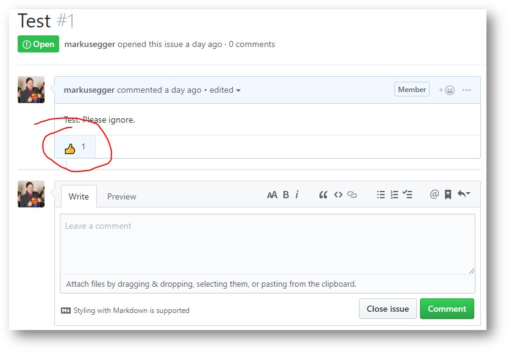

# RD-Summit-2019-Unconference
This repository is used to submit and vote on unconference sessions/topics. It is also used to upload related materials.

## Agenda (Tentative)

| Time Slot       | Great Room    | White         | Goodman       |
|-----------------|---------------|---------------|---------------|
| 7:00am-8:00am   | *--breakfast--* | *--breakfast--* | *--breakfast--* |
| 8:00am-8:50am   | RD Program and Visibility | Microsot Support in Community Events | Building Software That Lasts & Legacy Technologies |
| 8:50am-9:00am   | *--break--*     | *--break--*     | *--break--*     |
| 9:00am-9:50am   | Presenting Well | RDs as Industry Analysts | Staying Positive as a Windows Client Developer |
| 9:50am-10:00am  | *--break--*     | *--break--*     | *--break--*     |
| 10:00am-10:50am | The Future of RD Discussions | Physical Wellbeing | Values, Goals, and Ultimate Truths |
| 10:50am-11:00am | *--break--*     | *--break--*     | *--break--*     |
| 11:00am-12:00pm | Microsoft AI | Cybersecurity Panel | Programming for Kids |
| 12:00pm-1:00pm  | *--lunch--*     | *--lunch--*     | *--lunch--*     |

## Topics and Proposals

We are using "Issues" as our list of proposed topics. To propose a topic you would either like to say something about, or that you would like to learn more about, add an "Issue". Note that currently sessions are slated for 50 minutes each.

To vote on which topics you would like to see discussed at the unconference, flag an issue with a thumbs-up:

You can also leave comments if you would like to co-present a topic (or have other thoughts).

Submit topic recommendations sooner rather than later to give attendees the opportunity to vote. Whichever topics have the most thumbs-ups by 12:00PM PDT on Thursday, March 21 will be assigned dedicated time slots at the unconference on Friday, March 22. 

## Related Materials

We will upload related materials into the repository. Each topic will gets its own folder in the repository.

## Rules of RD Unconference

1.  **Talk about RD Unconference.** Document and share your learnings from each session with the group. But do not discuss NDA content at unconference! It is a violation of your RD NDA to discuss confidential material learned earlier in the week at MVP or RD Summit outside of the forum from where it was delivered by a Microsoft employee. 
2.  **Collaborate - we want conversations, not lecture-style presentations.** Submit an "Issue" with your name and topic recommendation through the RD Summit 2019 Unconference GitHub repo by 12:00PM PDT on March 21 to be considered.  
3.  **Vote for topics in the GitHub repo** that interest you by 12:00PM PDT on March 21. We'll hold as many sessions as time and facilities allow. The most popular topics will be assigned conference rooms, all others can spread out within the Reactor space.
4.  **Present, ask questions, spark conversations, and be an interactive participant.** No tourists - we encourage everyone to participate in some way, shape, or form. 
5.  **Make space for others.** Everyone should feel heard, respected, and like they had the opportunity to contribute.
6. **Follow the Law of Two Feet.** If you aren't inspired by a session or don't feel you can contribute, feel free to leave and find a different session. 
7.  **Be flexible.** Sessions will go on as long as they have to or until they run into another session slot. Sessions are slated for 50 minutes each, but if the session only runs for 30 minutes, feel free to change topics or break early and join another session! 
